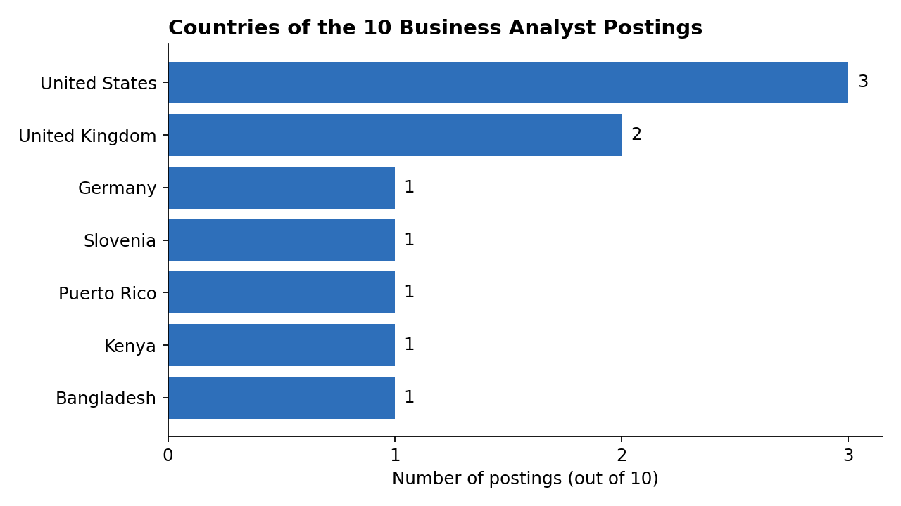
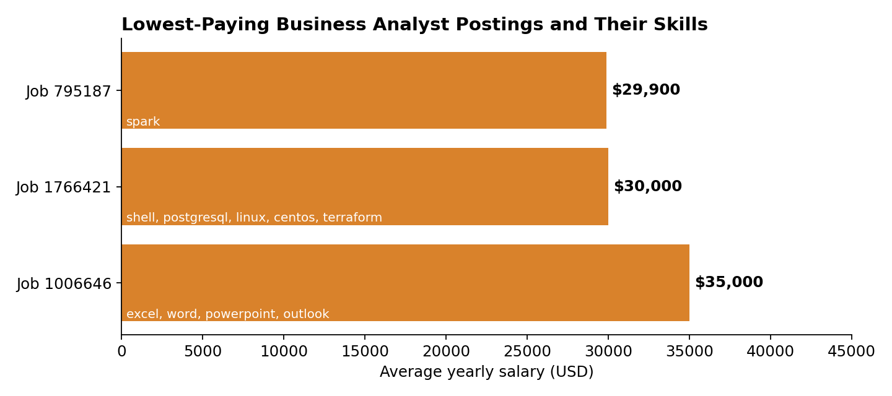
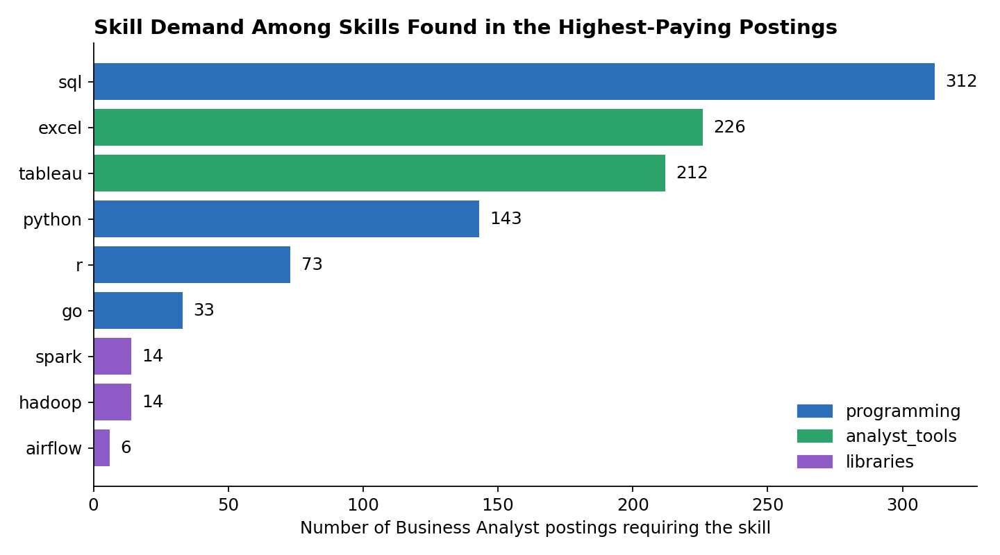
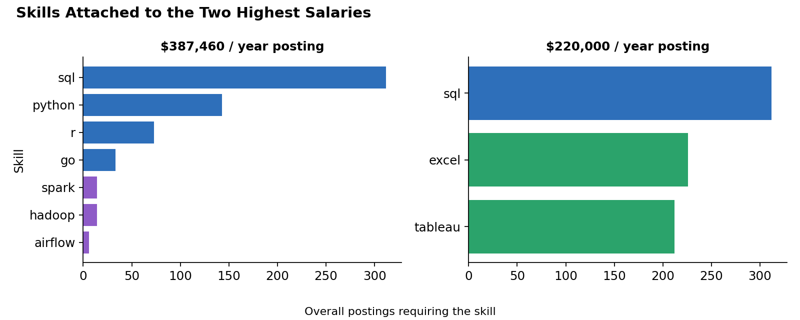

# 📊 Business Analyst Job Market Analysis (SQL)

An SQL project exploring the **Business Analyst** job market: where the jobs are, what the lowest and highest salaries look like, and which skills show up in the best-paid postings.

This is my first data analytics portfolio project, built while working toward a career as a professional Business Analyst.

---

## 📌 Table of Contents

1. [Project Goals](#-project-goals)
2. [Tools & Data](#-tools--data)
3. [Repository Structure](#-repository-structure)
4. [Analysis & Insights](#-analysis--insights)
5. [Key Takeaways](#-key-takeaways)
6. [Limitations](#-limitations)
7. [What I Learned](#-what-i-learned)
8. [Author](#-author)

---

## 🎯 Project Goals

The analysis answers these questions for the job title **Business Analyst**:

1. Which countries appear among the top-paying postings?
2. What are the lowest-paying postings, and which skills do they ask for?
3. Which skills are the least frequent in postings?
4. Which skills are linked to the highest salaries, and how in demand are they?

Only postings with a listed `salary_year_avg` were included.

---

## 🛠 Tools & Data

| Tool | Purpose |
|---|---|
| **SQL** | Querying, joins, CTEs, aggregation |
| **Python (matplotlib, pandas)** | Creating the charts from the exported CSVs |
| **GitHub** | Version control and publishing |

**Tables used**

| Table | Description |
|---|---|
| `job_postings_fact` | One row per job posting: title, salary, country, company ID |
| `company_dim` | Company names |
| `skills_job_dim` | Links each job to its skills |
| `skills_dim` | Skill names and skill types |

---

## 📁 Repository Structure

```
├── README.md
├── sql/
│   └── business_analyst_analysis.sql     # all queries
├── data/
│   ├── q1_countries.csv
│   ├── q2_lowest_paying_skills.csv
│   ├── q3_least_frequent_skills.csv
│   └── q4_skills_salary_demand.csv
└── images/
    ├── 01_countries.png
    ├── 02_lowest_paying_jobs.png
    ├── 03_skill_demand.png
    └── 04_top_paying_stacks.png
```

---

## 🔍 Analysis & Insights

### 1. Which countries appear among the top 10 postings?

The query takes the 10 highest-paying Business Analyst postings and counts them by country.

```sql
SELECT jobs.job_country, COUNT(*) AS total_job_postings
FROM (
    SELECT jp.job_id, jp.salary_year_avg, jp.job_country, c.name AS company_name
    FROM job_postings_fact jp
    LEFT JOIN company_dim c ON jp.company_id = c.company_id
    WHERE jp.salary_year_avg IS NOT NULL
      AND jp.job_title_short = 'Business Analyst'
    ORDER BY jp.salary_year_avg DESC
    LIMIT 10
) AS jobs
GROUP BY jobs.job_country
ORDER BY total_job_postings DESC;
```



**Insights**
- The 10 postings come from **7 countries**.
- The **United States** has the most (3), followed by the **United Kingdom** (2).
- Kenya, Bangladesh, Slovenia, Puerto Rico and Germany have one each.
- High-paying Business Analyst roles are not limited to the usual large markets. Postings from Africa, South Asia and Europe also appear.

---

### 2. What are the lowest-paying postings and which skills do they ask for?

```sql
SELECT jp.job_id, jp.job_title_short, s.skills, s.type, jp.salary_year_avg
FROM job_postings_fact jp
LEFT JOIN skills_job_dim sj ON jp.job_id = sj.job_id
LEFT JOIN skills_dim s ON sj.skill_id = s.skill_id
WHERE jp.salary_year_avg IS NOT NULL
  AND jp.job_title_short = 'Business Analyst'
  AND s.skills IS NOT NULL
ORDER BY jp.salary_year_avg ASC
LIMIT 10;
```



| Job ID | Salary (USD/year) | Skills |
|---|---|---|
| 795187 | $29,900 | spark |
| 1766421 | $30,000 | shell, postgresql, linux, centos, terraform |
| 1006646 | $35,000 | excel, word, powerpoint, outlook |

**Insights**
- The lowest salaries in the data sit between **$29,900 and $35,000** a year.
- One of the three postings asks only for Microsoft Office tools (Excel, Word, PowerPoint, Outlook), which suggests that office tools alone do not command high pay.
- Another posting lists server and infrastructure skills (Linux, CentOS, Terraform, shell) yet still pays about $30,000. This is a reminder that **listing many technical skills does not guarantee a high salary**. Location, company and role scope matter too.

---

### 3. Which skills are the least frequent?

```sql
SELECT jp.job_title_short, s.skills, s.type, COUNT(*) AS total_job_postings
FROM job_postings_fact jp
LEFT JOIN skills_job_dim sj ON jp.job_id = sj.job_id
LEFT JOIN skills_dim s ON sj.skill_id = s.skill_id
WHERE jp.salary_year_avg IS NOT NULL
  AND jp.job_title_short = 'Business Analyst'
  AND s.skills IS NOT NULL
GROUP BY s.skills, s.type, jp.job_title_short
ORDER BY total_job_postings ASC
LIMIT 10;
```

| Skill | Type | Postings |
|---|---|---|
| elasticsearch | databases | 1 |
| flutter | libraries | 1 |
| chef | other | 1 |
| delphi | programming | 1 |
| centos | os | 1 |
| electron | libraries | 1 |
| asana | async | 1 |
| chainer | libraries | 1 |
| assembly | programming | 1 |
| julia | programming | 1 |

**Insights**
- These are niche skills that appear in only one posting each.
- They are mostly software-development and infrastructure tools, which are far from the core Business Analyst toolkit.
- Many skills are tied at 1 posting, so this list is a sample of the rarest skills, not a ranking of the least useful ones.

---

### 4. Which skills are linked to the highest salaries, and how in demand are they?

This query uses two CTEs: one for salary per skill, and one for the number of postings per skill. They are joined to compare pay and demand.

```sql
WITH top_paying_skills AS (
    SELECT jp.job_id, jp.job_title_short, s.skills, s.type, jp.salary_year_avg
    FROM job_postings_fact jp
    LEFT JOIN skills_job_dim sj ON jp.job_id = sj.job_id
    LEFT JOIN skills_dim s ON sj.skill_id = s.skill_id
    WHERE jp.salary_year_avg IS NOT NULL
      AND jp.job_title_short = 'Business Analyst'
      AND s.skills IS NOT NULL
    ORDER BY jp.salary_year_avg DESC
),
top_overall_skills AS (
    SELECT jp.job_title_short, s.skills, s.type, COUNT(*) AS total_job_postings
    FROM job_postings_fact jp
    LEFT JOIN skills_job_dim sj ON jp.job_id = sj.job_id
    LEFT JOIN skills_dim s ON sj.skill_id = s.skill_id
    WHERE jp.salary_year_avg IS NOT NULL
      AND jp.job_title_short = 'Business Analyst'
      AND s.skills IS NOT NULL
    GROUP BY s.skills, s.type, jp.job_title_short
    ORDER BY total_job_postings DESC
)
SELECT tps.skills, tps.type, tps.salary_year_avg, tos.total_job_postings
FROM top_paying_skills tps
LEFT JOIN top_overall_skills tos ON tps.skills = tos.skills
ORDER BY tps.salary_year_avg DESC, tos.total_job_postings DESC
LIMIT 10;
```

**Demand for the skills found in the top-paying postings**



**The skills attached to the two highest salaries**



| Skill | Type | Postings requiring it |
|---|---|---|
| SQL | programming | 312 |
| Excel | analyst_tools | 226 |
| Tableau | analyst_tools | 212 |
| Python | programming | 143 |
| R | programming | 73 |
| Go | programming | 33 |
| Hadoop | libraries | 14 |
| Spark | libraries | 14 |
| Airflow | libraries | 6 |

**Insights**
- The highest salary in the data is **$387,460** a year. Its posting asks for SQL, Python, R, Go, Hadoop, Spark and Airflow, a heavy data-engineering and analytics stack.
- The second-highest salary, **$220,000**, appears alongside SQL, Excel and Tableau, which are mainstream analyst tools.
- **SQL is the most in-demand skill (312 postings)** and appears in both top-paying postings. It is the clearest starting point for an aspiring Business Analyst.
- **Excel (226) and Tableau (212)** are the next most requested, so they are strong foundational skills.
- **Python (143) and R (73)** are less common but show up in the best-paid posting.
- Big-data tools like **Hadoop, Spark and Airflow** are rare (6 to 14 postings) but belong to the top salary. They look like specialist skills with high pay and low demand.

---

## 💡 Key Takeaways

1. **Pay varies enormously.** The lowest postings pay about $30,000 a year, while the highest pays about $387,000, a gap of roughly 13×.
2. **SQL is the foundation.** It is the most requested skill and appears in the top-paying postings.
3. **Excel and Tableau are core tools.** Both have very high demand, and both appear in a posting paying $220,000.
4. **Technical depth is where the highest salaries show up.** Python, R and big-data tools appear in the top posting, but they are requested far less often than SQL and Excel.
5. **Office tools alone are not enough.** The posting with only Excel, Word, PowerPoint and Outlook was among the lowest paid.
6. **Top-paying jobs are global.** The highest-paying postings come from 7 different countries.

### Suggested learning path for an aspiring Business Analyst

`SQL → Excel → Tableau (or another BI tool) → Python → big-data tools (as a later specialisation)`

---

## ⚠️ Limitations

This is a first project, so it is worth being open about what the analysis can and cannot say.

- **Small samples.** Several results rest on 3 to 10 postings, so they are illustrations, not firm conclusions.
- **Only postings with salary data** were included, which may not represent the whole market.
- **Salary is shown per posting, not averaged per skill.** In query 4, each skill row carries the salary of one posting, so the salary figures show which skills appear in high-paying jobs. They are not the average salary of each skill.
- **Query 4 shows a partial skill list.** `LIMIT 10` cuts the output, so the $220,000 posting may require more skills than the three listed.
- **Query 3 is a sample, not a ranking,** because many skills are tied at 1 posting.
- **Salary currency and location are not normalised,** so salaries from different countries are compared directly.
- **Countries for the lowest-paying postings** are not shown separately.

### Ideas for improving this analysis
- Use `GROUP BY skills` with `AVG(salary_year_avg)` and `COUNT(*)` to get one row per skill.
- Add a minimum-postings filter (`HAVING COUNT(*) >= 10`) to avoid results driven by one posting.
- Compare Business Analyst roles with Data Analyst and Data Scientist roles.
- Add salary analysis by country.

---

## 🎓 What I Learned

- Writing multi-table `JOIN` queries across fact and dimension tables
- Using CTEs to combine salary and demand analysis
- Filtering `NULL` values and sorting with `ORDER BY` and `LIMIT`
- Turning query output into charts and written insights
- Recognising the limits of small datasets

---

## 👤 Author

**Md Kutub Uddin Bahar**

- GitHub: [your-username](https://github.com/your-username)
- LinkedIn: [your-profile](https://linkedin.com/in/your-profile)

⭐ If you found this project useful, feel free to star the repository.
