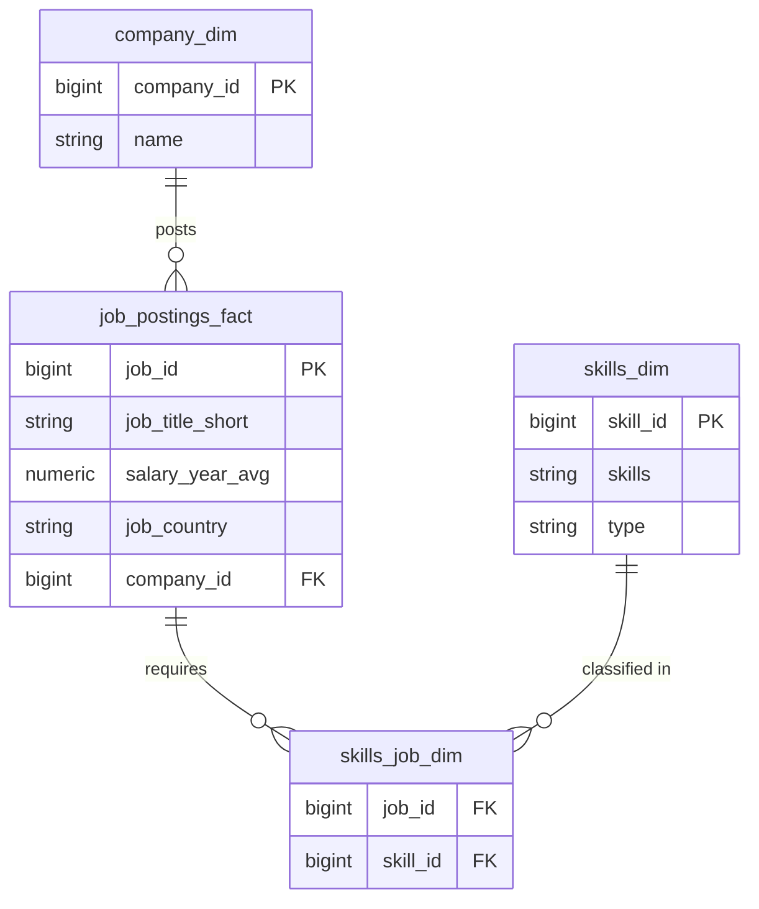

# 📊 Business Analyst Job Market & Salary Analysis

An end-to-end data analysis project investigating salary distributions, geographic hot spots, required skills, and optimal career pathways for the **Business Analyst** job role using **SQL**.

## 📌 Table of Contents

1. [Overview & Project Goals](#overview--project-goals)
2. [Data Architecture & Schema](#data-architecture--schema)
3. [Analysis & Key Findings](#analysis--key-findings)
   - [Q1: Salary Distribution & Geographic Spread](#q1-salary-distribution--geographic-spread)
   - [Q2: High-Paying Roles & Required Skills](#q2-high-paying-roles--required-skills)
   - [Q3: Skill Demand Analysis](#q3-skill-demand-analysis)
   - [Q4: Optimal Skills (High Demand + High Pay)](#q4-optimal-skills-high-demand--high-pay)
4. [Key Insights & Strategic Recommendations](#key-insights--strategic-recommendations)
5. [SQL Queries & Methodology](#sql-queries--methodology)
6. [How to Run This Project](#how-to-run-this-project)

---

## Overview & Project Goals

The objective of this project is to analyze market demand and compensation structures for Business Analyst roles. By mining job posting data, this project answers key industry questions:

- What are the highest and lowest paying jobs for Business Analysts?
- Where are high-paying vs. entry-level/lower-paying jobs geographically concentrated?
- Which skills are most frequently requested across job listings?
- Which skills provide the highest financial return on investment (ROI)?

---

## Data Architecture & Schema

The dataset follows a normalized relational structure consisting of job postings, company dimensions, and skills linkages:

---

## Analysis & Key Findings

### Q1: Salary Distribution & Geographic Spread

#### 📈 Top 10 Highest Paying Roles

The highest-paying job posting reaches **$387,500/year**, with top roles ranging between **$175,000 and $387,500**.

| Job ID  | Title            | Company    | Country       | Avg Salary (USD) |
|---------|------------------|------------|---------------|------------------|
| 648429  | Business Analyst | Mantys     | United States | $387,500         |
| 502610  | Business Analyst | Meta       | United States | $220,000         |
| 112859  | Business Analyst | Google     | United States | $214,500         |
| 998056  | Business Analyst | Overmind   | Slovenia      | $200,000         |
| 393753  | Business Analyst | Torc       | United States | $200,000         |
| 1069582 | Business Analyst | Meta       | United States | $200,000         |
| 898755  | Business Analyst | Databricks | United States | $190,500         |
| 17458   | Business Analyst | OpenAI     | United States | $190,000         |
| 20066   | Business Analyst | Snowflake  | United States | $185,000         |
| 516397  | Business Analyst | Palantir   | United States | $175,000         |

.png)
