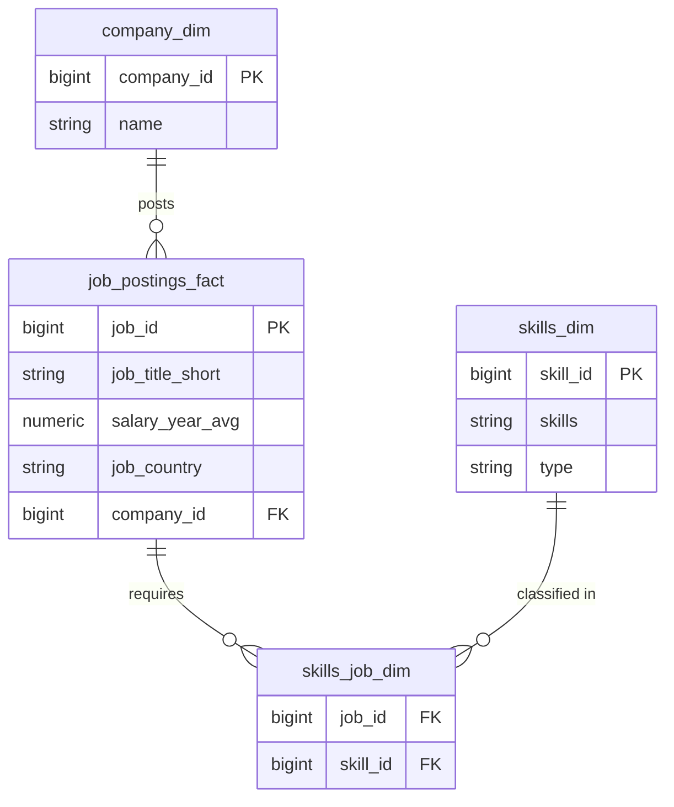
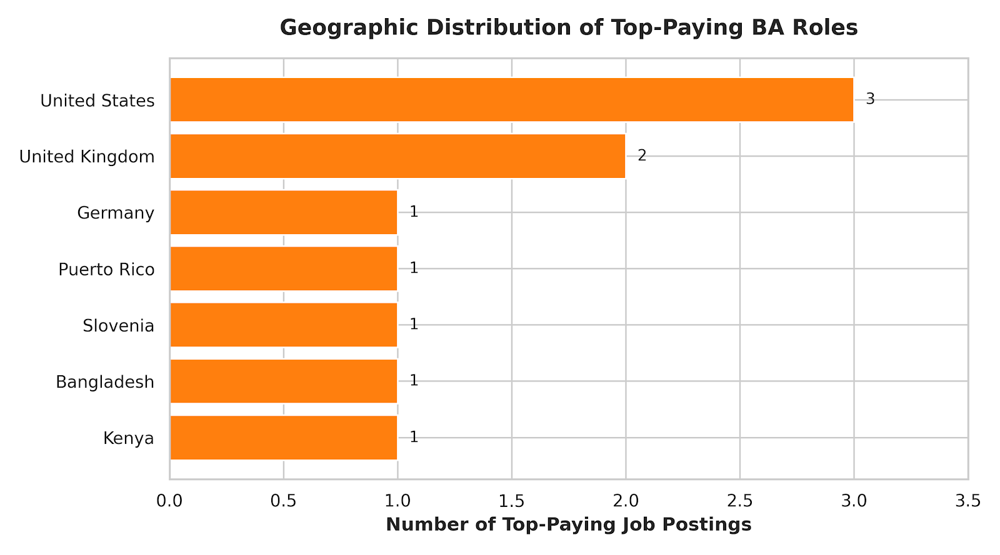
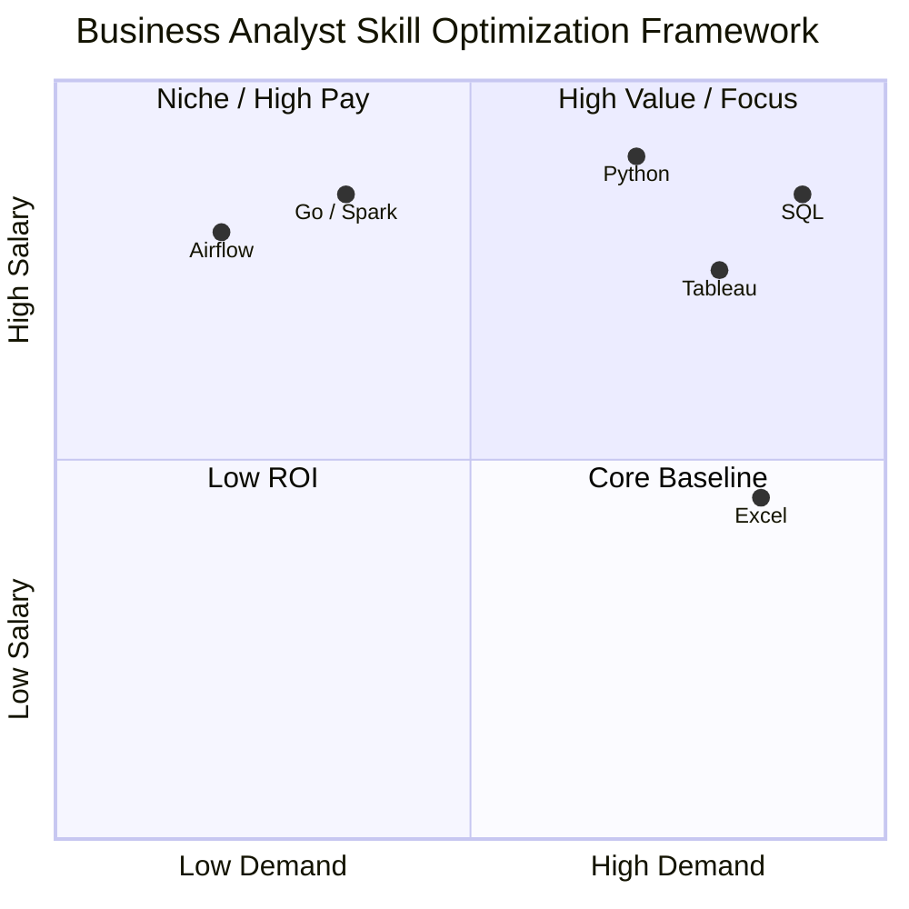

# 📊 Business Analyst Job Market & Salary Analysis

An end-to-end data analysis project investigating salary distributions, geographic hot spots, required skills, and optimal career pathways for the **Business Analyst** job role using **SQL**.

## 📌 Table of Contents

1. [Overview & Project Goals](#overview--project-goals)
2. [Data Architecture & Schema](#data-architecture--schema)
3. [Analysis & Key Findings](#analysis--key-findings)
   - [Q1: Salary Distribution & Geographic Spread](#q1-salary-distribution--geographic-spread)
   - [Q2: High-Paying Roles & Required Skills](#q2-high-paying-roles--required-skills)
   - [Q3: Skill Demand Analysis](#q3-skill-demand-analysis)
   - [Q4: Optimal Skills (High Demand + High Pay)](#q4-optimal-skills-high-demand--high-pay)
4. [Key Insights & Strategic Recommendations](#key-insights--strategic-recommendations)
5. [SQL Queries & Methodology](#sql-queries--methodology)
6. [How to Run This Project](#how-to-run-this-project)

---

## Overview & Project Goals

The objective of this project is to analyze market demand and compensation structures for Business Analyst roles. By mining job posting data, this project answers key industry questions:

- What are the highest and lowest paying jobs for Business Analysts?
- Where are high-paying vs. entry-level/lower-paying jobs geographically concentrated?
- Which skills are most frequently requested across job listings?
- Which skills provide the highest financial return on investment (ROI)?

---

## Data Architecture & Schema

The dataset follows a normalized relational structure consisting of job postings, company dimensions, and skills linkages:



---

## Analysis & Key Findings

### Q1: Salary Distribution & Geographic Spread

#### 📈 Top 10 Highest Paying Roles

The highest-paying job posting reaches **$387,500/year**, with top roles ranging between **$175,000 and $387,500**.

| Job ID  | Title            | Company    | Country       | Avg Salary (USD) |
|---------|------------------|------------|---------------|------------------|
| 648429  | Business Analyst | Mantys     | United States | $387,500         |
| 502610  | Business Analyst | Meta       | United States | $220,000         |
| 112859  | Business Analyst | Google     | United States | $214,500         |
| 998056  | Business Analyst | Overmind   | Slovenia      | $200,000         |
| 393753  | Business Analyst | Torc       | United States | $200,000         |
| 1069582 | Business Analyst | Meta       | United States | $200,000         |
| 898755  | Business Analyst | Databricks | United States | $190,500         |
| 17458   | Business Analyst | OpenAI     | United States | $190,000         |
| 20066   | Business Analyst | Snowflake  | United States | $185,000         |
| 516397  | Business Analyst | Palantir   | United States | $175,000         |

.png>)

#### 🌎 Geographic Breakdown

- **Top-Paying Jobs:** Concentrated in the United States (30%) and United Kingdom (20%), alongside international tech/remote roles in Germany, Puerto Rico, Slovenia, Bangladesh, and Kenya.
- **Lowest-Paying Jobs:** Dispersed across global markets, ranging from **$30,000 to $45,000/year**.



### Q2: High-Paying Roles & Required Skills

Analyzing skill requirements in top-paying positions shows a strong push toward modern data processing and cloud architecture tools.

#### 🛠 Core Technical Stack for High Pay

- **Database & Languages:** SQL, Python, Go, R
- **Big Data & Pipelines:** Spark, Hadoop, Airflow
- **Data Visualization & Analytics:** Tableau, Excel

### Q3: Skill Demand Analysis

#### 📊 Top Most Demanded Skills

The baseline requirements for Business Analysts are heavily grounded in relational databases and analytics tools:

| Rank | Skill Name | Category                | Total Job Postings |
|------|------------|-------------------------|--------------------|
| 1    | SQL        | Database / Querying     | 312                |
| 2    | Excel      | Spreadsheet / Analysis  | 226                |
| 3    | Tableau    | Data Visualization      | 212                |
| 4    | Python     | Programming             | 143                |
| 5    | R          | Statistical Programming | 73                 |
| 6    | Go         | Programming             | 33                 |
| 7    | Spark      | Big Data                | 14                 |
| 8    | Hadoop     | Big Data                | 14                 |
| 9    | Airflow    | Data Orchestration      | 6                  |

.png>)

### Q4: Optimal Skills (High Demand + High Pay)

Combining salary values and posting frequencies highlights the most strategic skills to learn:



---

## Key Insights & Strategic Recommendations

1. **SQL is Non-Negotiable:** SQL appears in 312 job postings, solidifying its status as the foundational skill for any Business Analyst.
2. **Visualization Bridge:** Tableau (212 postings) and Excel (226 postings) remain essential for translating raw analytical findings into business metrics.
3. **High-Pay Differentiators:** Adding Python, Spark, or cloud/orchestration frameworks (Airflow) bridges the gap between traditional Business Analysis and high-yield Data Engineering / Advanced Analytics roles.

---

## SQL Queries & Methodology

Below is the complete SQL script used to extract all findings:

```sql
/* Question 1: Top 10 paying jobs for 'Business Analyst' */
SELECT 
    jp.job_id,
    jp.job_title_short,
    jp.salary_year_avg,
    jp.job_country,
    c.name AS Company_Name
FROM job_postings_fact jp
LEFT JOIN company_dim c ON jp.company_id = c.company_id
WHERE jp.salary_year_avg IS NOT NULL 
  AND jp.job_title_short = 'Business Analyst'
ORDER BY jp.salary_year_avg DESC
LIMIT 10;

/* Q1.2 Top lowest paying jobs for 'Business Analyst' */
SELECT 
    jp.job_id,
    jp.job_title_short,
    jp.salary_year_avg,
    jp.job_country,
    c.name AS Company_Name
FROM job_postings_fact jp
LEFT JOIN company_dim c ON jp.company_id = c.company_id
WHERE jp.salary_year_avg IS NOT NULL 
  AND jp.job_title_short = 'Business Analyst'
ORDER BY jp.salary_year_avg ASC
LIMIT 10;

/* Q1.3 Geographic breakdown for top-paying jobs */
SELECT 
    jobs.job_country,
    COUNT(*) AS Total_Job_Postings
FROM (
    SELECT 
        jp.job_id,
        jp.job_country
    FROM job_postings_fact jp
    LEFT JOIN company_dim c ON jp.company_id = c.company_id
    WHERE jp.salary_year_avg IS NOT NULL 
      AND jp.job_title_short = 'Business Analyst'
    ORDER BY jp.salary_year_avg DESC
    LIMIT 10
) AS jobs
GROUP BY jobs.job_country
ORDER BY Total_Job_Postings DESC;

/* Q2 Top individual highest paying postings and required skills */
WITH top_jobs AS (
    SELECT job_id, job_title_short, salary_year_avg
    FROM job_postings_fact
    WHERE salary_year_avg IS NOT NULL
      AND job_title_short = 'Business Analyst'
    ORDER BY salary_year_avg DESC
    LIMIT 10
)
SELECT
    tj.job_id,
    tj.job_title_short,
    tj.salary_year_avg,
    s.skills,
    s.type
FROM top_jobs tj
LEFT JOIN skills_job_dim sj ON tj.job_id = sj.job_id
LEFT JOIN skills_dim s      ON sj.skill_id = s.skill_id
ORDER BY tj.salary_year_avg DESC;

/* Q3.1 Top 10 Overall Skills for 'Business Analyst' */
SELECT
    jp.job_title_short,
    s.skills,
    s.type,
    COUNT(*) AS Total_Job_Postings
FROM job_postings_fact jp
LEFT JOIN skills_job_dim sj ON jp.job_id = sj.job_id
LEFT JOIN skills_dim s      ON sj.skill_id = s.skill_id
WHERE jp.salary_year_avg IS NOT NULL 
  AND jp.job_title_short = 'Business Analyst' 
  AND s.skills IS NOT NULL
GROUP BY s.skills, s.type, jp.job_title_short
ORDER BY Total_Job_Postings DESC
LIMIT 10;

/* Q4 Most Optimal Skills based on Salary & Demand */
WITH Top_paying_Skills AS (
    SELECT 
        jp.job_id,
        jp.job_title_short,
        s.skills,
        s.type,
        jp.salary_year_avg
    FROM job_postings_fact jp
    LEFT JOIN skills_job_dim sj ON jp.job_id = sj.job_id
    LEFT JOIN skills_dim s      ON sj.skill_id = s.skill_id
    WHERE jp.salary_year_avg IS NOT NULL 
      AND jp.job_title_short = 'Business Analyst' 
      AND s.skills IS NOT NULL
    ORDER BY jp.salary_year_avg DESC
),
Top_Overall_Skills AS (
    SELECT 
        jp.job_title_short,
        s.skills,
        s.type,
        COUNT(*) AS Total_Job_Postings
    FROM job_postings_fact jp
    LEFT JOIN skills_job_dim sj ON jp.job_id = sj.job_id
    LEFT JOIN skills_dim s      ON sj.skill_id = s.skill_id
    WHERE jp.salary_year_avg IS NOT NULL 
      AND jp.job_title_short = 'Business Analyst' 
      AND s.skills IS NOT NULL
    GROUP BY s.skills, s.type, jp.job_title_short
    ORDER BY Total_Job_Postings DESC
) 
SELECT 
    tps.skills,
    tps.type,
    tps.salary_year_avg,
    tos.Total_Job_Postings
FROM Top_paying_Skills tps
LEFT JOIN Top_Overall_Skills tos ON tps.skills = tos.skills
ORDER BY tps.salary_year_avg DESC, tos.Total_Job_Postings DESC
LIMIT 10;
```

---

## How to Run This Project

1. **Clone the repository:**

```bash
   git clone https://github.com/kutubbahar2018-cpu/Sqp_project.git
   cd Sqp_project
```

2. **Database setup:** Import the dataset files (`job_postings_fact`, `company_dim`, `skills_job_dim`, `skills_dim`) into PostgreSQL or MySQL.

3. **Execute queries:** Run the scripts in your SQL editor (e.g., pgAdmin, DBeaver, VS Code SQLTools).
